# Dark-Web-Investigations

## Dark Web Vendor Profiling & OSINT Correlation Investigation

This project shows how you can combine dark web reconnaissance with open-source intelligence (OSINT) to build a profile of an online persona and try to find links between activity on a dark web marketplace and publicly visible accounts elsewhere online.

The goal was to find a marketplace vendor, gather whatever public information was visible about them, use their username to search other platforms, and see whether the same identity turned up anywhere else.

Everything here relied only on publicly available information and content that was visible on the marketplace. I didn't gain unauthorized access to anything, exploit anything, communicate with vendors, make purchases, or do anything intrusive.

---

# Case Information

| Field | Details |
|---------|---------|
| Case Title | Dark Web Vendor Profiling & OSINT Correlation |
| Examiner | Philip Oppong Adanse |
| Investigation Type | Dark Web Intelligence & OSINT |
| Platform | Kali Linux |
| Browser | Tor Browser |
| Target Alias | Blacknoir001 |
| Methodology | Passive Intelligence Collection |
| Examination Date | August 2026 |

---

# Executive Summary

This investigation examined a dark web marketplace vendor operating under the alias **Blacknoir001**. The objective was to determine whether publicly available information could be linked with the observed marketplace identity through passive intelligence collection and OSINT techniques.

The investigation covered dark web reconnaissance, building a vendor profile, pivoting off the username, checking social media, and assessing attribution. I found several public accounts using the same alias across Telegram, GitHub, Pinterest, and YouTube.

Although definitive attribution was not established, the investigation successfully demonstrated how dark web intelligence gathering and OSINT methodologies can be combined to generate investigative leads while remaining within legal and ethical boundaries.

---

# Table of Contents

- [Executive Summary](#executive-summary)
- [Objectives](#objectives)
- [Scope](#scope)
- [Methodology](#methodology)
- [Tools Used](#tools-used)
- [Phase 1: Dark Web Reconnaissance](#phase-1-dark-web-reconnaissance)
- [Phase 2: Vendor Profiling](#phase-2-vendor-profiling)
- [Phase 3: Username Pivoting](#phase-3-username-pivoting)
- [Phase 4: OSINT Correlation](#phase-4-osint-correlation)
- [Phase 5: Public Footprint Analysis](#phase-5-public-footprint-analysis)
- [Findings](#findings)
- [Attribution Assessment](#attribution-assessment)
- [Attribution Matrix](#attribution-matrix)
- [Limitations](#limitations)
- [Lessons Learned](#lessons-learned)
- [Conclusion](#conclusion)
- [Disclaimer](#disclaimer)

---

# Objectives

The objectives of this investigation were:

- Find an active vendor on a dark web marketplace.
- Collect publicly observable marketplace intelligence.
- Document vendor profile.
- Identify potential OSINT pivot points.
- Perform username correlation across public platforms.
- Assess attribution opportunities.
- Demonstrate the value of combining dark web intelligence with OSINT methodologies.

---

# Scope

The investigation was limited to:

- Publicly accessible onion services.
- Content visible on the marketplace..
- Open-source intelligence gathering.
- Matching usernames across platforms.
- Public social media platforms.

The following activities were specifically excluded:

- Unauthorized access.
- Exploiting the marketplace.
- Purchases or transactions.
- Trying to bypass logins.
- Social engineering.
- Direct communication with marketplace operators or vendors.

---

# Methodology

I followed a structured process made up of five phases:

1. Dark Web Reconnaissance
2. Vendor Profiling
3. Username Pivoting
4. OSINT Correlation
5. Attribution Assessment

Each phase built on the one before it, information gathered from the marketplace was then checked against publicly accessible resources.

---

# Tools Used

| Tool | Purpose |
|---------|---------|
| Kali Linux | The operating system used for the investigation |
| Tor Browser | Dark Web Access |
| SpiderFoot | Automatically searches for a username across many platforms |
| DuckDuckGo | Search Correlation |
| Telegram | Used to check and confirm usernames |
| GitHub | Used to check for a matching developer profile |
| Pinterest | Used to check for a matching social profile |
| YouTube | Used to check for a matching channel |

---

# Phase 1: Dark Web Reconnaissance

## Tor Browser Configuration

I started inside a Kali Linux environment and set up Tor Browser as the way to access onion services. Tor works by sending your traffic through several encrypted relay points, which is the standard way to access hidden services on the Tor network.

The goal at this stage was simply to get a working, secure connection to the Tor network before starting any actual intelligence gathering.


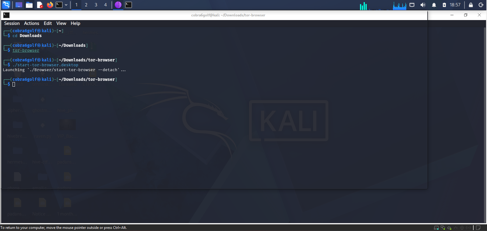

---


## Establishing Tor Connectivity

After setting things up, I connected to the Tor network and confirmed it was working.

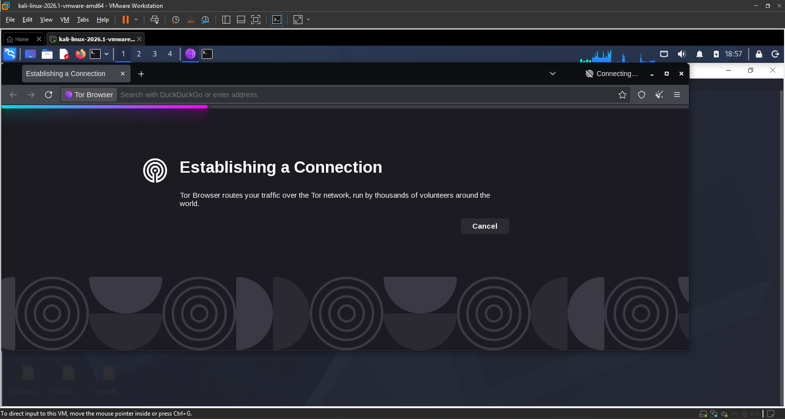


A working connection means requests are properly routed through Tor, so onion sites load correctly.

---


## Tor Network Verification

Once connected, Tor Browser confirmed I had successfully reached the network.

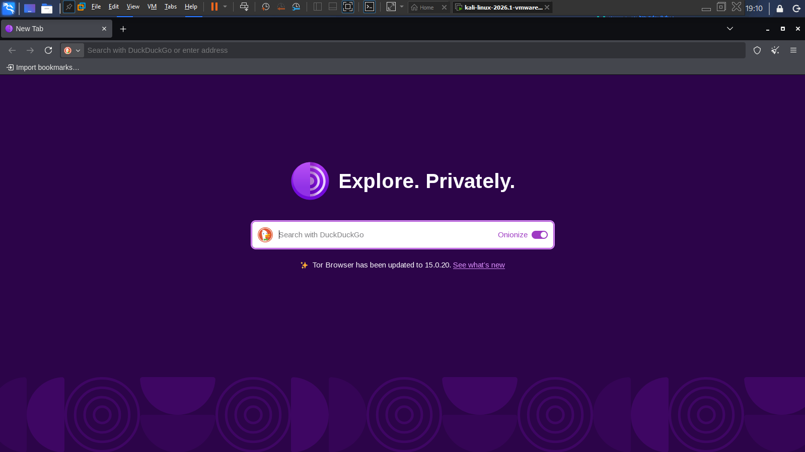

It's important to double-check this connection before doing anything else, so you know your actions are happening in the right environment.

---


## Hidden Service Discovery

The next stage i identified active onion services using publicly accessible dark web directories.

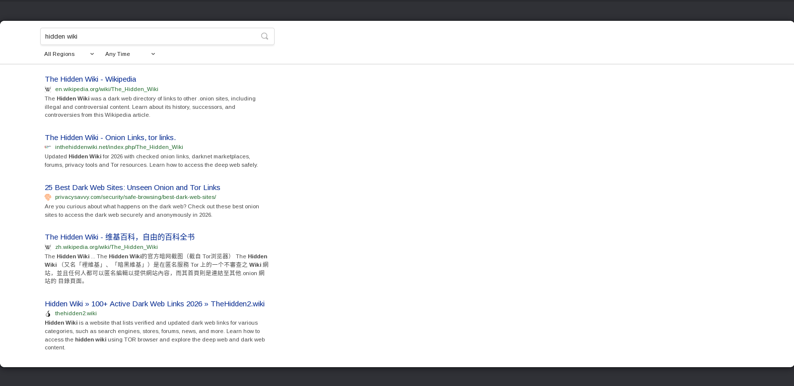


The Hidden Wiki served as a starting point for identifying categories of available onion services.


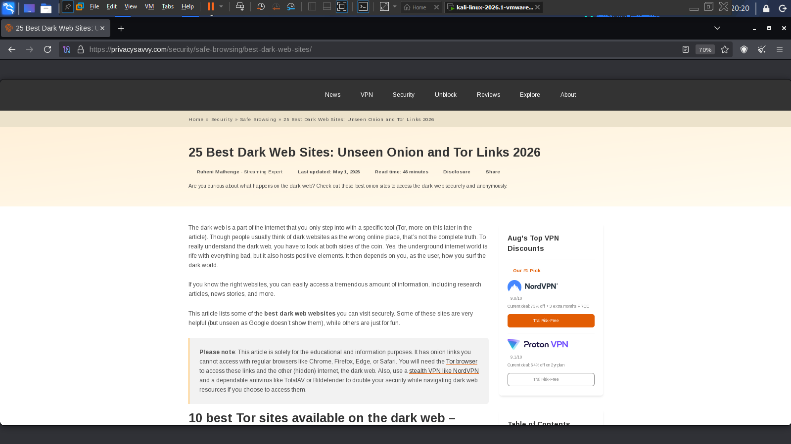


I checked a few more onion directories too.


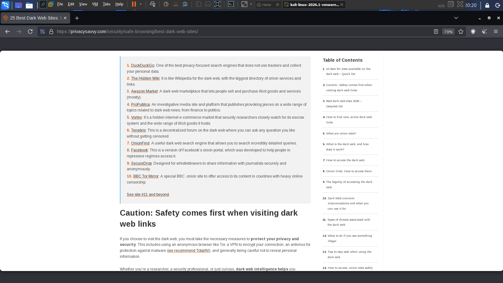


I found and reviewed several marketplace-related onion services to see which ones would be useful for gathering intelligence.

---


## Marketplace Access

Once I found a suitable marketplace, I created an account purely to observe and gather intelligence. **NB: Don't use your real information on the dark web.**

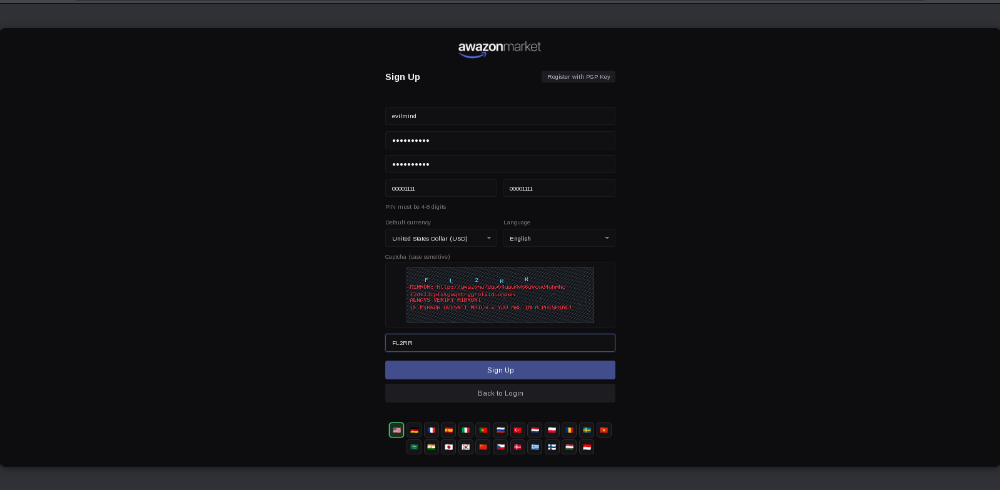


Authentication was completed successfully.


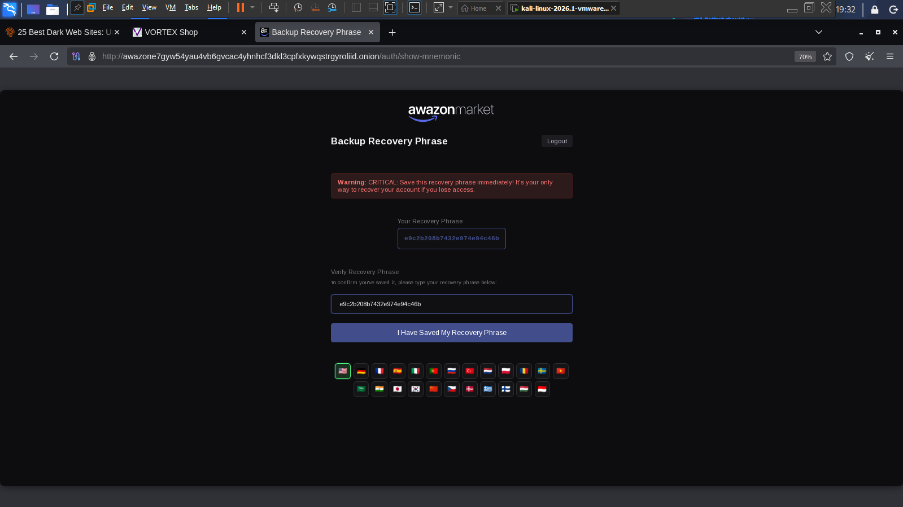


The marketplace dashboard became accessible.


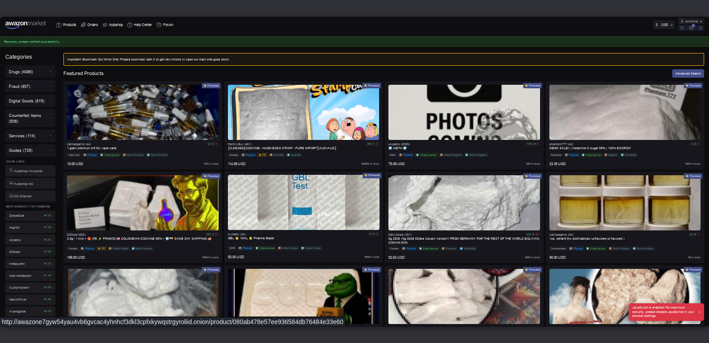


With access to the marketplace, I could now look at publicly visible vendor profiles and marketplace activity.

---


# Phase 2: Vendor Profiling

## Vendor Discovery

While looking around the marketplace, I checked several vendor profiles to find good candidates for this investigation. One profile stood out, a vendor using the alias **Blacknoir001.**


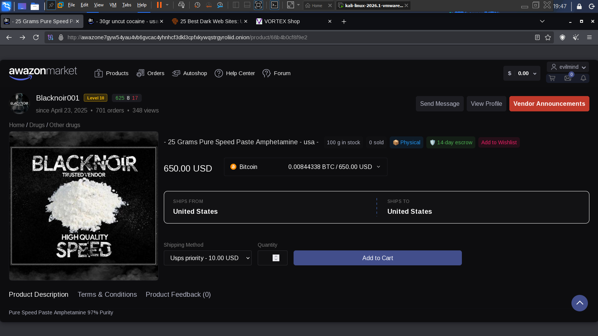


This vendor looked active and clearly had an established presence on the marketplace. Looking closer gave me more details about their activity and reputation.

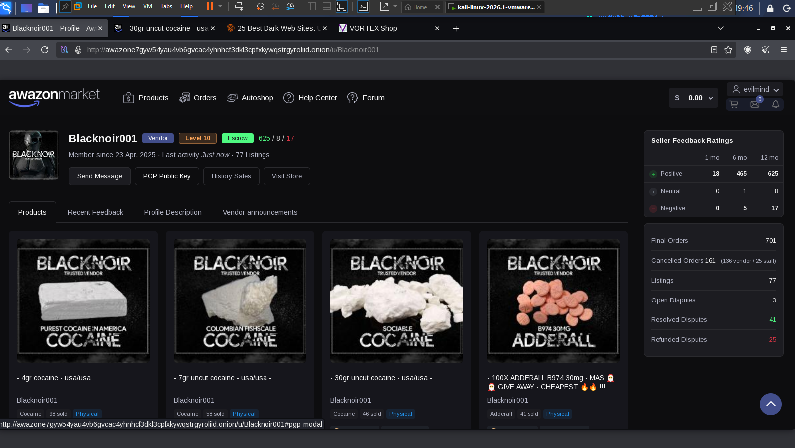

---


## Marketplace Intelligence Collection

Once I found the vendor's profile, I wrote down everything publicly visible about them.

### Observed Indicators

- Vendor Alias
- Marketplace Activity
- Product Listings
- Reputation Indicators
- Historical Presence
- Communication References

This profile had all the signs of an established, long-running vendor account. From an investigative point of view, the username was the most valuable clue, since people often reuse the same alias on other platforms.

I **DID NOT** interact with the vendor at any point during this phase.

---


# Phase 3: Username Pivoting

## Telegram Enumeration

I took the alias Blacknoir001 and used it as my starting point for OSINT pivoting. I chose Telegram because it's commonly used in underground communities for chatting and support.


This search turned up two Telegram profiles with similar names.


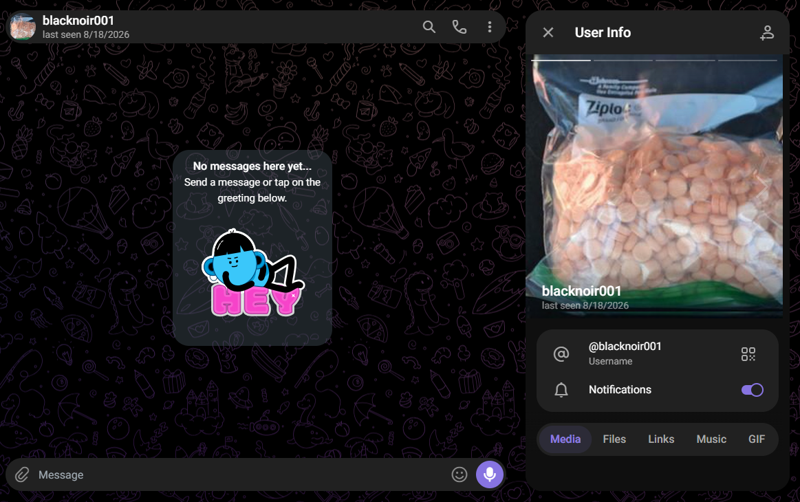

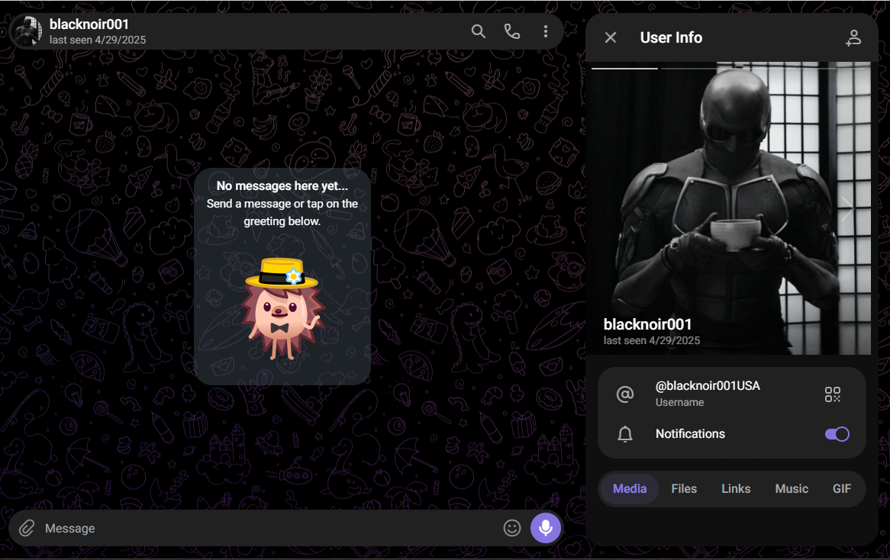

### Usernames Observed

```text
@blacknoir001
@blacknoir001USA
```

Finding the marketplace alias reused outside the dark web suggested there might be some overlap in how this person operates across different platforms.

---


# Phase 4: OSINT Correlation

## SpiderFoot Analysis

I used SpiderFoot to automatically search for and match the username across different platforms.

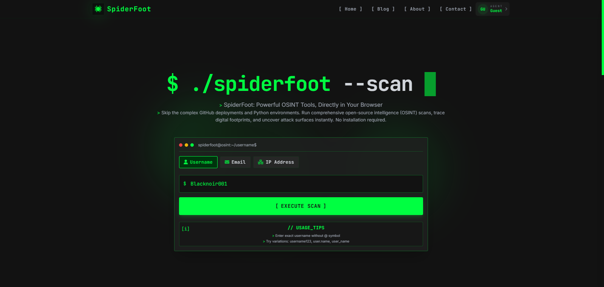


SpiderFoot identified multiple services containing references to the observed alias.


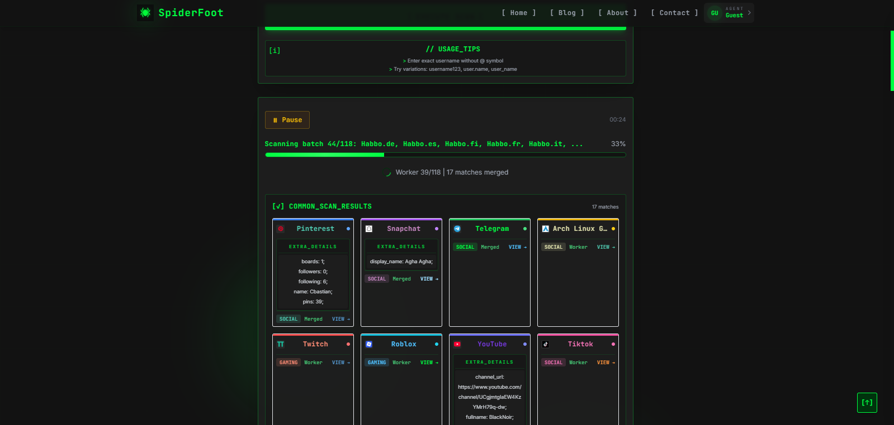


I gathered a few more correlation results too.


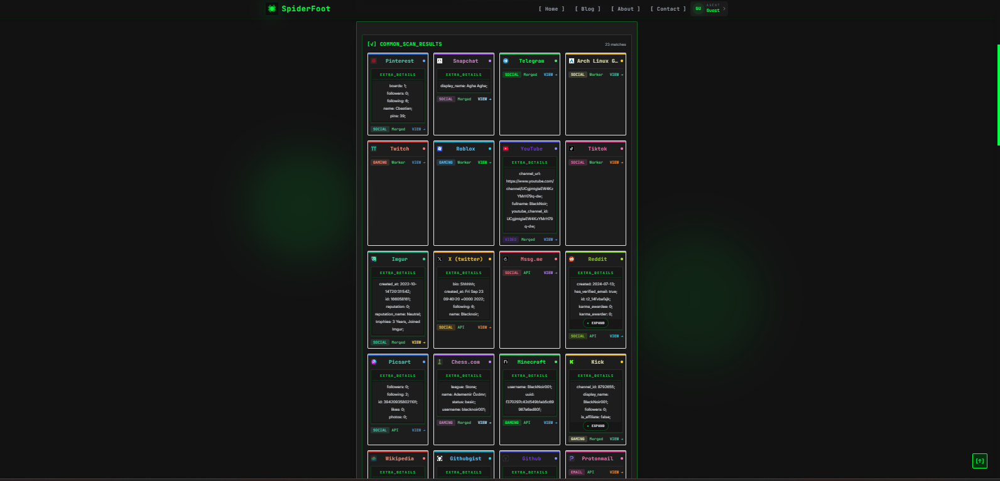


These automated results gave me useful leads, but they still needed manual double-checking.

---

## Search Engine Correlation

I manually searched to confirm and build on what SpiderFoot found.


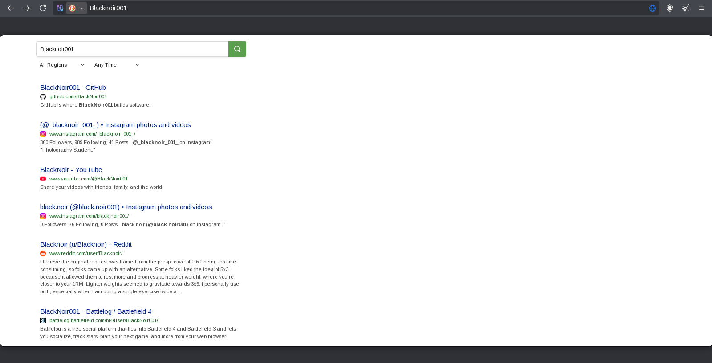


This manual check turned up more references to the same alias across publicly indexed pages.

---


# Phase 5: Public Footprint Analysis

## Pinterest Discovery

I found a Pinterest profile using the same alias.


This shows how a username first spotted on the dark web can sometimes show up on completely mainstream platforms too.

---

## GitHub Discovery

I also found a GitHub profile with the same alias.

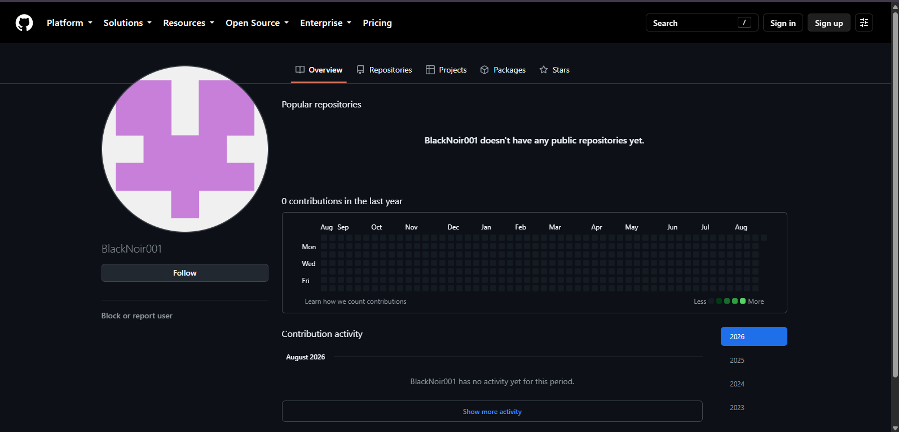

There wasn't much public information on it, but it's still another useful lead and another sign of the same alias being reused.

---

## YouTube Discovery

Lastly, I found a YouTube profile matching the same username.

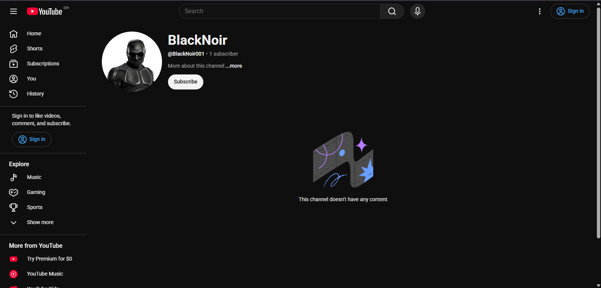


Seeing the alias show up again and again across different platforms makes it more likely this username is actively and consistently reused by the same person.

---


# Findings

### Finding 1

A vendor using the alias **Blacknoir001** was found on a dark web marketplace.

### Finding 2

This vendor had an active profile with a visible history on the marketplace.

### Finding 3

Pivoting off the username turned up Telegram accounts using the same alias.

### Finding 4

SpiderFoot found several public references tied to this username.

### Finding 5

Additional accounts were discovered on Pinterest, GitHub, and YouTube.

### Finding 6

The same alias kept showing up consistently across separate, unrelated platforms.

### Finding 7

None of this evidence directly proved who the real person behind the accounts is.

---

# Attribution Assessment

This investigation found several online accounts using the alias **Blacknoir001.** Reusing the same username across platforms is a useful lead, but it's not enough on its own to prove that all these accounts belong to the same person, or to reveal their real identity.

I found no extra evidences like an email address, a photo, hidden metadata, blockchain activity, or other personal details that would confirm a real-world identity.


---

# Attribution Matrix

| Indicator | Observation | Investigative Value |
|------------|------------|------------|
| Username | Blacknoir001 | High |
| Telegram Presence | Observed | Medium |
| GitHub Presence | Observed | Medium |
| Pinterest Presence | Observed | Low |
| YouTube Presence | Observed | Low |
| Real Name | Not Identified | N/A |
| Email Address | Not Identified | N/A |

### Attribution Confidence

| Assessment | Confidence |
|------------|------------|
| Username Reuse | High |
| Common Ownership | Low to Moderate |
| Real-World Attribution | Low |

---

# Limitations

- I only used publicly available information.
- Someone else could be impersonating this username, which would throw off my results.
- I couldn't see anything hidden behind private account settings.
- I had no access to any platform's backend systems.
- No corroborating identity evidence.

---

# Lessons Learned

- Username reuse remains one of the most valuable OSINT pivot points.
- People running dark web personas often leave traces online completely within public platforms.
- Automated tools speed things up a lot, but you still need to manually check what they find.
- Correlation does not equal attribution.
- Multiple independent indicators are required before identity conclusions can be drawn.

---

# Conclusion

This investigation showed how combining dark web reconnaissance with open-source intelligence techniques can help build a profile of an online persona and generate solid investigative leads.

The vendor known as Blacknoir001 kept an active presence on the marketplace and appeared to reuse the same alias across several public platforms, including Telegram, Pinterest, GitHub, and YouTube.

While I couldn't confirm a definite real-world identity, this investigation shows how valuable username-based pivoting and OSINT correlation can be when digging into dark web activity.

---

# Disclaimer

This investigation only used publicly available information and open-source intelligence techniques, for educational, research, and digital forensics training purposes.

No unauthorized access, exploitation, intrusion, bypassing of security controls, or illegal activity took place during this investigation.

Finding the same username on multiple platforms doesn't prove who owns those accounts. Every finding here should be treated as a lead that still needs independent verification before anyone draws firm conclusions about a real identity.

---

# Examiner

**Philip Oppong Adanse**  
Digital Forensics Analyst
