# Vendor PGP Key Analysis
## Cryptographic Identity Assessment of Dark Web Vendor "Blacknoir001"

---

## Investigation Overview

Following the successful completion of the Vendor Profiling phase, a deeper examination was conducted into the cryptographic identity associated with the vendor **Blacknoir001**.

While profiling the vendor on the marketplace, I noticed a publicly available OpenPGP (PGP) key on their profile. PGP keys are commonly used on dark web marketplaces as a trusted way for buyers and vendors to communicate. They let people encrypt messages, confirm identities, and stay operationally secure while doing business.

Cryptographic identities tend to stay the same across platforms and over long stretches of time, unlike usernames, which people change often. Because of this, a PGP key can offer useful intelligence that goes beyond what's visible on a marketplace profile alone.

So the point of this phase was to find out, could this vendor's PGP key give me more clues about who they are, show a history of activity, tell me something about their operational security, or reveal intelligence that marketplace profiling alone couldn't?

---

# Relationship to the Vendor Profiling Investigation

In the earlier investigation, I found the vendor Blacknoir001 on the Awazon Marketplace and documented them as an established seller.

Key observations from the Vendor Profiling phase included:

- Vendor Alias: **Blacknoir001**
- Vendor Level: **Level 10**
- Marketplace Status: Active
- Positive Feedback: 629
- Active Listings: 77
- Completed Orders: 703
- Marketplace Join Date: April 2025
- Escrow Enabled: Yes
- Public PGP Key Available: Yes

Finding a public PGP key was a valuable lead, because it opened up a whole separate layer of identity to investigate. Marketplace usernames can be changed, dropped, or recreated at any time. Cryptographic keys, on the other hand, tend to stick around for years and can reveal relationships, infrastructure, or other clues that help future investigations.

That's why I decided to examine the vendor's PGP key more closely.


---

# Investigation Objectives

The objectives of this examination were:

- Collect and preserve the vendor's public PGP key.
- Check that the key was genuine and valid.
- Extract cryptographic identifiers.
- Find any email addresses linked to the key.
- Determine how old the key was and how long it had been in use.
- Examine packet-level metadata.
- Search public key servers for the same key.
- CCompare these findings with what I learned during vendor profiling.
- Assess attribution opportunities.

---

# Tools Used

| Tool | Purpose |
|---------|---------|
| Kali Linux | The operating system used for the investigation |
| GnuPG (GPG) | Used to check and analyze the PGP key |
| OpenPGP Key Server | Used to confirm the public key |
| Ubuntu Keyserver | Used for a second, independent check on the key |
| Tor Browser | Used to access the marketplace |
| Awazon Marketplace | Where the original intelligence came from |

---

# Evidence Acquisition

I went back to the vendor's profile to grab the public PGP key.

## Vendor Profile

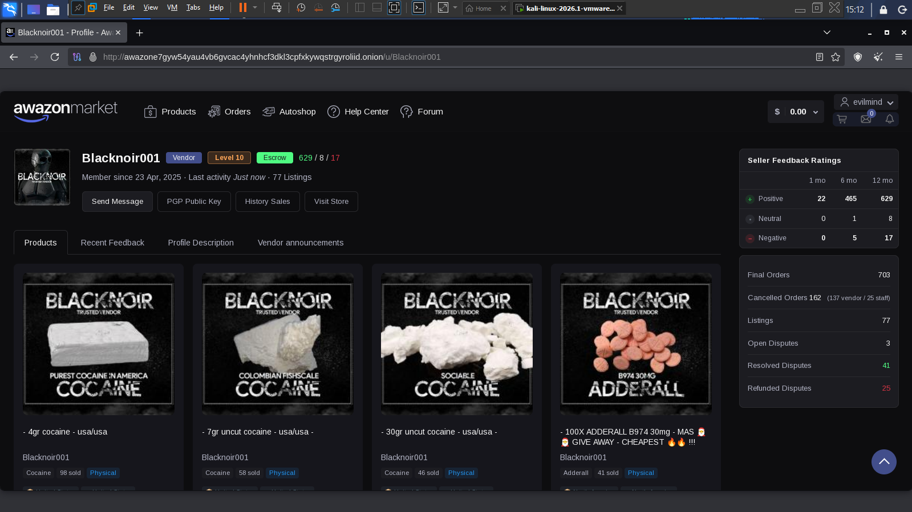

The profile confirmed this was an established vendor, and it had a public PGP key posted for encrypted communication.

---

## Public Key Collection

I copied the full OpenPGP key straight from the vendor's profile and saved it as evidence.

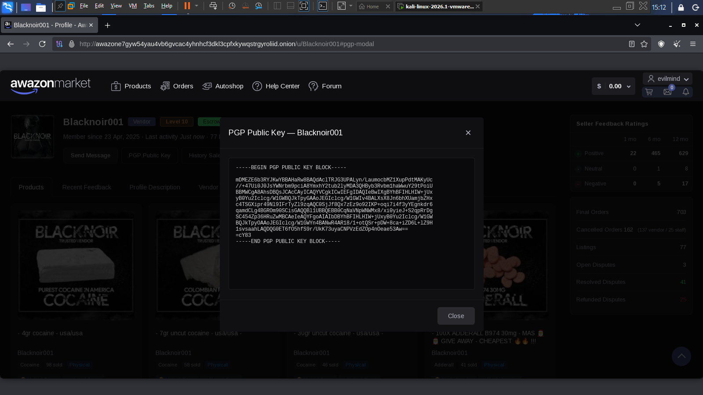

The original key was collected without modification to preserve evidential integrity.

---

# Evidence Preservation

I set up a dedicated evidence folder to store everything I collected, so the process could be repeated later if needed.

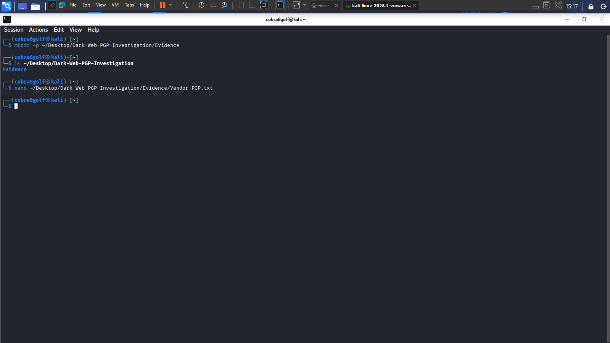

I saved the public key as:

```text
Vendor-PGP.txt
```

---

## Saving the Key

The collected key was saved for future examination.

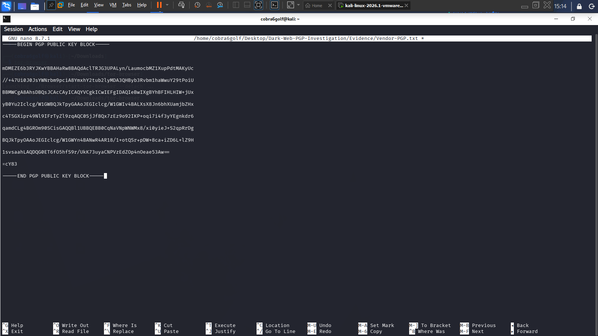

---

## Verification of Evidence Preservation

I reopened the file to make sure it had saved correctly.

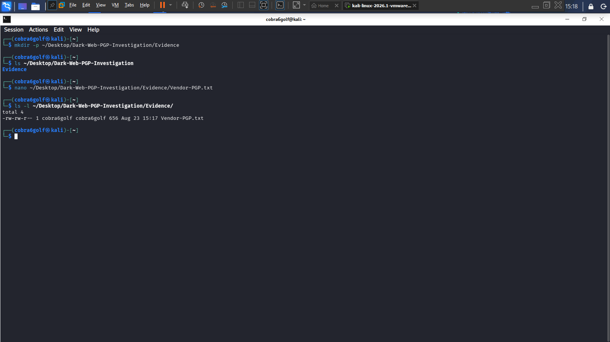

This confirmed the key was stored properly and ready for analysis.

---

# Importing the Key

I imported the public key into GnuPG so I could examine it.

Command:

```bash
gpg --import Vendor-PGP.txt
```

The import worked, and GPG found a user ID linked to the key.

---

# Key Enumeration

I checked the imported key to see what metadata was attached to it.

Command:

```bash
gpg --list-keys
```

Command:

```bash
gpg --fingerprint
```

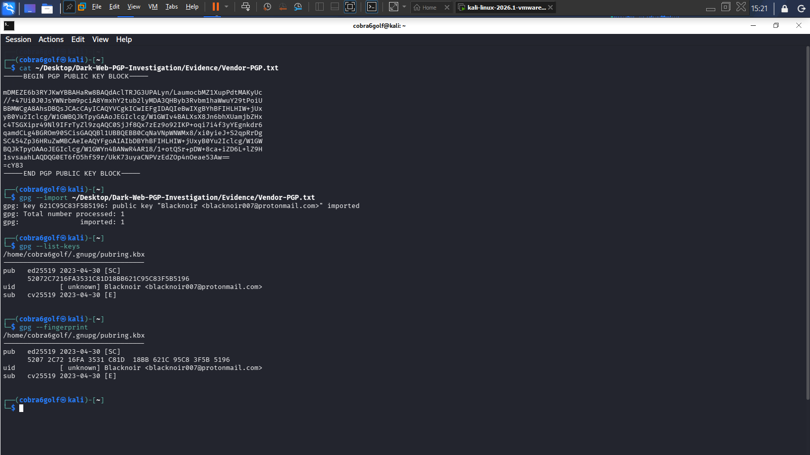

---

# Fingerprint Preservation

The generated fingerprint was preserved as a separate evidence artifact.

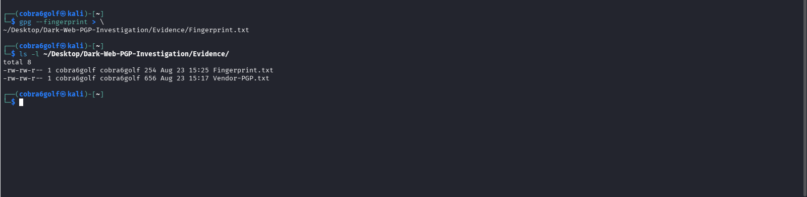

---

# Cryptographic Identity Identified

Here's what the analysis showed:

| Attribute | Value |
|------------|---------|
| Alias | Blacknoir |
| Email Address | blacknoir007@protonmail.com |
| Key ID | 621C95C83F5B5196 |
| Primary Algorithm | ED25519 |
| Encryption Subkey | CV25519 |
| Creation Date | 2023-04-30 |

---

# Investigative Significance

This finding was a big step forward for the investigation. During Vendor Profiling, all I had was the marketplace alias:

```text
Blacknoir001
```

was available.

PGP analysis revealed:

```text
Blacknoir <blacknoir007@protonmail.com>
```

This gave me a brand new lead to work with:

```text
blacknoir007@protonmail.com
```

This email could be useful for future OSINT work, marketplace research, or investigating communications.

---

# Packet-Level Analysis

To check the internal structure of the key, I looked at it at the packet level.

Command:

```bash
gpg --list-packets Vendor-PGP.txt
```

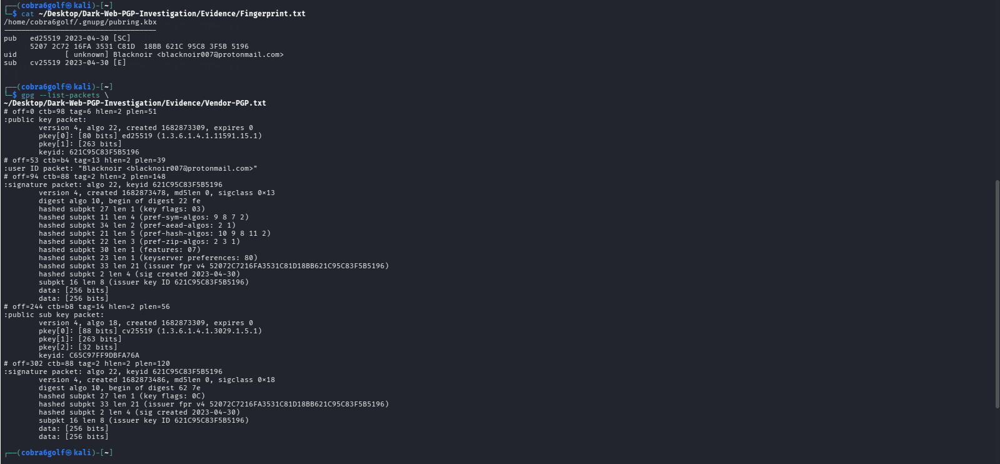

---

# Packet Analysis Findings

The examination identified:

### Primary Key

```text
Algorithm: ED25519
```

### Encryption Subkey

```text
Algorithm: CV25519
```

### User ID

```text
Blacknoir <blacknoir007@protonmail.com>
```

### Key Creation Date

```text
2023-04-30
```

### Self-Signatures

The key had valid self-signatures, which link the user identity to the cryptographic key and confirm it's genuine. I didn't find any other user IDs, alternate emails, or hidden identities attached to it.

---

# Vendor Profile Correlation

I compared the identity from the PGP key against the marketplace profile.

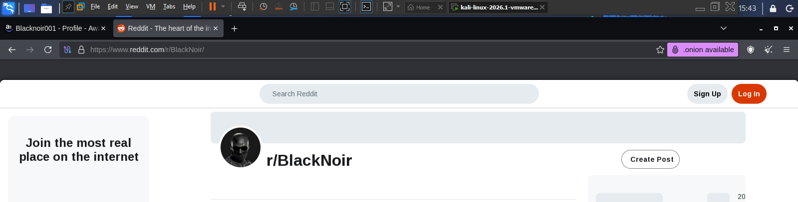

The comparison revealed consistency between:

| Marketplace | PGP |
|------------|---------|
| Blacknoir001 | Blacknoir |
| Active Vendor | Active Key |
| Marketplace Identity | Cryptographic Identity |

The naming pattern strongly suggests this is the same person using both identities.

---

# Public Key Infrastructure Verification

To check if this key existed outside the marketplace, I searched for the fingerprint on public key servers.

---

## OpenPGP Verification

I found the key successfully on the OpenPGP public key server.

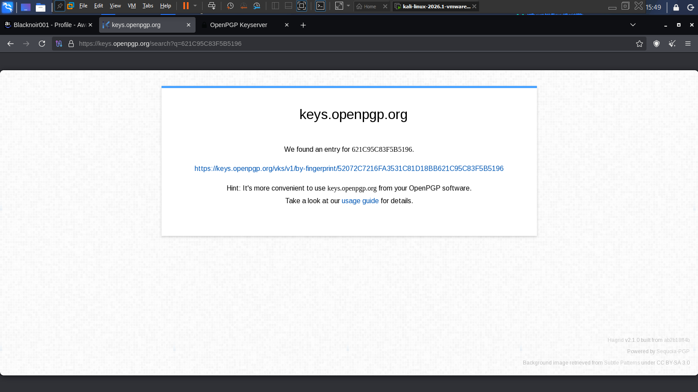

The fingerprint matched exactly, confirming this key exists independently of the marketplace.

---

## Ubuntu Keyserver Verification

A second verification was conducted using the Ubuntu OpenPGP Keyserver.

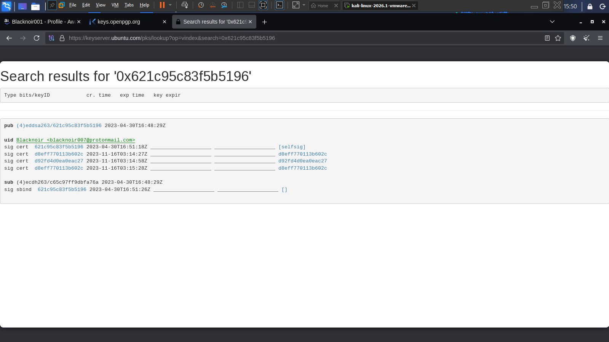

The same key, user ID, and fingerprint were recovered.

I found the same key, the same user ID, and the same fingerprint there as well. This second, independent match makes it more confident that the key is real and actively being used.

---

# Operational Security Assessment

A few things suggest this vendor knows something about operational security.

Evidence includes:

- Using ProtonMail (a privacy-focused email provider)
- Using public key infrastructure
- Using modern, secure cryptographic algorithms
- Having a dedicated encryption subkey
- Keeping their identity consistent across platforms

These are things you'd typically expect from an experienced marketplace user, not a beginner.

---

# Intelligence Gained from PGP Analysis

Compared to the original Vendor Profiling phase, this PGP investigation gave me:

### New Intelligence

- A verified email address
- A verified cryptographic identity
- A verified key creation date
- Confirmation the key exists on public key servers
- A long-term timeline of activity

### Corroborated Intelligence

- The same naming pattern used by the vendor
- Established operational history
- Confirmation the vendor is still active

---

# Findings

### Finding 1

The vendor has a valid OpenPGP public key.

### Finding 2

The key is linked to:

```text
Blacknoir <blacknoir007@protonmail.com>
```

### Finding 3

The key was created on:

```text
2023-04-30
```

which is earlier than the marketplace activity I observed.

### Finding 4

The key shows up on more than one public key server.

### Finding 5

The vendor shows signs of operational security awareness, through their use of ProtonMail and modern cryptographic standards.

### Finding 6

No other identities or extra clues were found.

---

# Conclusion

This PGP analysis added a lot to what I already knew from the Vendor Profiling investigation.

Vendor profiling gave me behavioral and marketplace-based intelligence, how the vendor acted and what their marketplace presence looked like. PGP analysis went a level deeper, into their cryptographic identity.

I found a verified OpenPGP identity linked to the email blacknoir007@protonmail.com, confirmed this cryptographic setup has existed since April 2023, and verified the key across multiple public key servers.

I still couldn't confirm a real-world identity directly, but this PGP key gives investigators a long-lasting piece of evidence that could support future intelligence gathering, OSINT work, communication analysis, and further dark web investigations.

---

# Disclaimer

This investigation was conducted exclusively using publicly accessible information, open-source intelligence techniques, and publicly available cryptographic infrastructure.

**No unauthorized access, exploitation, intrusion, or circumvention of security controls was performed.**

All findings should be treated as investigative leads and not as conclusive attribution evidence without independent verification.
